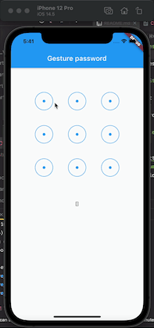

# flutter_gesture_password

A flutter gesture password widget.

## Preview



## Install

run this command:

```
flutter pub add flutter_gesture_password
```

This will add a line like this to your package's pubspec.yaml:

```
dependencies:
  flutter_gesture_password: ^0.0.1
```

## Usage

```dart
import 'package:flutter/material.dart';
import 'package:flutter_gesture_view/gesture_view.dart';

void main() {
  runApp(MyApp());
}

class MyApp extends StatelessWidget {
  @override
  Widget build(BuildContext context) {
    return MaterialApp(
      title: 'Gesture password',
      home: _Home(),
    );
  }
}

class _Home extends StatefulWidget {
  @override
  State<StatefulWidget> createState() => _HomeState();
}

class _HomeState extends State<_Home> {
  List<int>? pathArr;

  @override
  Widget build(BuildContext context) {
    final screenWidth = MediaQuery.of(context).size.width;
    return Scaffold(
      appBar: AppBar(
        title: Text('Gesture password'),
      ),
      body: Column(
        children: [
          GestureView(
            width: screenWidth,
            height: screenWidth,
            listener: (arr) {
              setState(() {
                pathArr = arr;
              });
            },
          ),
          Text("${pathArr == null ? '' : pathArr}")
        ],
      ),
    );
  }
}

```
